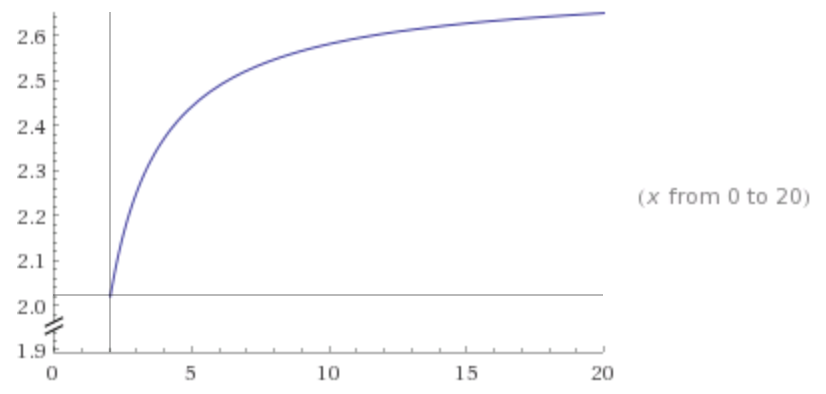

# Rolling Reboots and the Last Tranche

The other day, I got a flood of alerts for high CPU usage. As it turns out, a developer was doing a deploy of the latest sprint release. There appeared to be a correlation, and upon investigation we noticed an odd pattern: there was a sort of "wave" of load. As the release went on, the load on the untouched servers got higher and higher. It was like the remaining servers were getting "squeezed".

Our initial response was to increase the number of "batches" of servers that were out of service at any given time - that is, to divide our pool into smaller tranches.

Imagine our surprise when it didn't help!

That got me thinking: what is the actual effect of resizing the tranches? Could I model this sytem?

## Frictionless Spherical Servers in a Vacuum

I'm going to make some simplifying assumptions. The real world is messy, but I think knowing how the ideal case behaves can inform further investigations into noisier systems. Of course in reality, clients disappear, servers come up gradually, and client load grows over time. In this case, let's take it as axiomatic that:

* client connections are persistent, and a client won't disconnect unless a server goes away (thus ignoring upstream network issues),
* clients aggressively reconnect when disconnected (ignoring client misbehavior),
* the server pool is load balanced either randomly or round-robin (it doesn't matter for our purposes), and
* servers stay out of the pool for longer than it takes for a client to reconnect (a client will never end up on the same server).

None of these parameters are too crazy, right?

As a rough analogy, think of it like marbles (clients) in buckets (servers). The point is that clients, like marbles, won't move without reason.

## The Process of a Rolling Restart

Consider a pool of _h_ hosts divided into _n_ tranches, with _m_ clients. They've been running happily for a while, and client load per host has become evenly distributed, with _m / h_ clients per host. It's release time, and the hosts must be restarted (or replaced, as the case may be).

### In two tranches

We divide our infrastructure into two groups of hosts, and shut down half of it at a time.

At `T=0`, our load is evenly divided:

Now we shut off the servers in the first tranche (_k1_). At `T=1`, we have moved the contents of the first trache into the second (_k2_):

At `T=2`, we have completed the rollout, and moved the contents of _k2_ into _k1_:

Note that the most any tranche sees is *100%* of the total load. This is a pretty obvious result, since each tranche is alone during the rollout.

Put another way, each trache sees a 100% *increase* in load (from `1/2` to `1`). In order to absorb this increase, each tranche must have twice its normal carrying capacity. Again, pretty obvious.

Perhaps we can do better by dividing the infrastructure up further?

### In three tranches

Now we divide our infrastructure into three tranches.

As before, at `T=0`, our load is evenly distributed:

We shut off the _k1_ tranche, dividing its load evenly between the remaining two. At `T=1`, these tranches are each supporting half the load:

Next, we shut off _k2_, diving _its_ load evenly. At `T=2`, the first tranche _k1_ ends up with _1/4_ of the load, while the third tranche _k3_ ends up carrying _3/4_ of the load.

Finally, we shut off the last tranche, dividing its load in turn:

The highest load any individual tranche sees is _3/4_ of the total. This is not as much in absolute terms, but what is the proportion of growth? Carrying _3/4_ from an initial condition of _1/3_ represents a _125%_ increase!

Therefore, in order to absorb the peak load, the last tranche must be overprovisioned by 125%.

What if we divide our infrastructure into fourths?

### In four tranches

As before, our initial condition is an even distribution:

Shut off the first tranche; Distribute its load:

Repeat for each tranche:

I left fractions in order to make the math more obvious, but the trend here is probably clear. Given four tranches, the peak load seen by a tranche is _16/27_, or _~60%_.

Rising to _16/27_ from _1/4_ represents a _*137%*_ increase from nominal! By now the trend is clear: the more we subdivide our infrastructure, the harder we hammer the last tranche.

Let's formalize this so we can see how bad it gets.

## A mathematical model

For _n_ tranches of _m_ connections, we can describe the number of connections held by the last tranche at the _n-1_ th iteration as:

where

As _n_ increases, what is the limit of _Cn_?

Substituting _r_:

with _s &equiv; n - 1_. Let _h &equiv; 1 / s_:

As _h &rarr; 0_, then _n &rarr; &infin;_. Therefore, we can express the limit of _Cn_ as _n &rarr; &infin;_ in terms of _e_:

If we're interested in the _ratio_ of our initial value, _C0(n) = m / n_, to the eventual peak at some _Cn&rarr;&infin;_, the result is:

## Implications of subdivision

It's the increase we're worried about. If the last tranche only has 20% extra capacity to carry transient load spikes or failures, is that enough? In our simplified rolling-reboot scenario, the answer is a definite **no**. In fact, if you have less than 100% capacity, you will _never_ have enough.

I find this _seriously_ fascinating and _wildly_ counterintuitive.

As you divide your infrastructure more and more finely in an attempt to reduce the risk of things falling over, you _increase_ the spare carrying capacity necessary to handle the load transferred to the last tranche. And it's never lower than 100%! Here's what this looks like in graphical form:

([Wolfram Alpha](http://www.wolframalpha.com/input/?i=y%3D((1%2Fx)*((1%2B(1%2F(x-1)))%5E(x-1)))%2F(1%2Fx)+from+0+to+20))

The _x_ axis is the number of subdivisions, and the _y_ axis is the factor that load increases. Notice that the lowest value is 2, and it only goes up (and indeed approaches _e_).

## Does this happen in reality?

Er, no.

That is to say, I haven't been able to draw any conclusions about how closely this models reality based on the systems I can observe and the data I have. I am working on improving my metrics in order to try and see how closely production mirrors the predictions here, but nothing is clear enough yet for me to say... anything at all, really.

## Final thoughts

### The user experience

It's worth keeping in mind that, in a rolling reboot scenario, there's some nonzero probability that a particularly unlucky user will be disconnected as many as _n_ times as they're chased from tranche to tranche. If reconnects are expensive or disruptive, this can have a negative impact on user experience or system stability.

### Preventing the "wave"

There are a few approaches to preventing this "wave" of load from swelling too high.

* **Load balancing**
	
	Sometimes the hosts you have in production are _all_ the hosts you have. In that case, it may be useful to shape traffic that's reconnecting.
	
	I haven't modelled out the system, but I'm willing to bet there's some easily-calculated load-balancer weight curve that could be applied. The aim would be to make the LB strongly prefer to send connecting traffic to tranche _kT-1_, as this tranche is always the least-loaded.

* **Add one box**

    A simpler solution is always to keep a single, spare tranche in reserve with no load. When a tranche goes down, direct all reconnecting traffic to the spare. Then declare the newly-restarted hosts to be the "spare" tranche, and repeat.

* **Blue-green deployment**

    In a cloud-based environment, it's often possible to completely instantiate another environment, and then simply dump _all_ reconnecting traffic to it. This is the "one box" approach writ large.

## Acknowledgements

Thanks to [Dr. Bing Kwan](http://eng.fsu.edu/ece/people/kwan.html), Professor of Electrical Engineering at the FAMU-FSU College of Engineering
